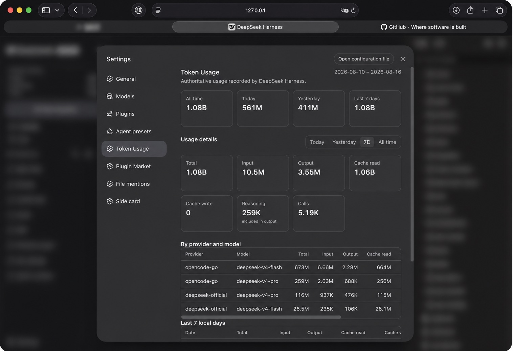

# dsh-token-usage-sidebar

English | [简体中文](#中文说明)

A community [DeepSeek Harness](https://github.com/deepseek-ai/deepseek-harness) (DSH) web-profile plugin that keeps provider-reported token usage locally. It provides both a persistent sidebar summary and a native **Token Usage** settings page.

```text
TOKEN USAGE
Today       …
Yesterday   …
Total       …
```

This is a community plugin, not an official DeepSeek plugin.

## Features

- Sidebar summary: Today, Yesterday, and lifetime Total.
- Native **Settings → Token Usage** page, placed after Agent Presets and before Plugin Market.
- Four overview cards: All time, Today, Yesterday, and Last 7 days.
- Detail range selector: Today, Yesterday, 7D, and All time.
- Per-range totals for Input, Output, Cache Read, Cache Write, Reasoning, and call count.
- Provider/model table, sorted by Total, plus a seven-local-day table that retains zero-value days.
- Persistent local accounting that survives DSH restarts.
- Historical recovery from available authoritative session usage records.
- Replay-safe, deduplicated accounting: an invocation is counted once.
- Native placement in the DSH web sidebar.



## Installation

Install from GitHub into the DSH `web` profile, then restart DSH:

```bash
dsh plugin --profile web add github:y2zyyr/dsh-token-usage-sidebar
# Restart `dsh web` after installation.
```

Review third-party source before installing. Pin a commit when your workflow requires a reproducible dependency revision.

## Update

Update the installed plugin, then restart DSH:

```bash
dsh plugin --profile web update dsh-token-usage-sidebar
# Restart `dsh web` after updating.
```

## Removal

```bash
dsh plugin --profile web remove dsh-token-usage-sidebar
# Restart `dsh web` after removal.
```

Removing the plugin does not reset its separately persisted local accounting data.

## How it works

```text
DSH/provider usage records
        ↓
historical and live collection
        ↓
deduplication
        ↓
persistent local accounting
        ↓
sidebar summary
```

The plugin uses provider/runtime-reported usage records rather than tokenizer estimates. Total is `input + cache read + cache write + output`; **Reasoning** is displayed as an output subdivision and is never added to Total a second time. It uses the final committed assistant message's `message.source.provider` and `message.source.model` when available.

All day-based ranges use the DSH host's local calendar days. Last 7 days includes today plus the previous six local days. The settings page receives aggregate results only; it never receives the individual invocation ledger.

### Migration and historical coverage

v1.0.0 performs one idempotent replay of recoverable persistent DSH session events to enrich existing calls with their exact buckets and model metadata. A previously recorded call is only enriched, or replaced by a higher-sequence final message: it is not added to lifetime usage again.

Some legacy calls may have a reliable All time total but no recoverable date, bucket, provider, or model. Those tokens remain included in All time and are explicitly shown as **unclassified coverage**. They are never invented into a date or model row.

## Data & Privacy

Usage accounting stays local to the DSH runtime. The source repository does not receive, contain, or upload a user's token ledger. Runtime persistence is separate from the source code and release artifacts.

The plugin stores accounting metadata needed for reliable totals, such as deduplication identity, date bucket, and token totals. It does not persist prompts, assistant text, tool output, API keys, credentials, or conversation content as part of its ledger.

## Compatibility and Status

Current release: v1.0.0.

Verified with DeepSeek Harness `0.1.0-rc.6` and its `web` profile. No broader DSH-version or operating-system compatibility is claimed.

## Development

```bash
npm install
npm test
npm run build
```

`npm test` runs the accounting and historical-recovery tests. `npm run build` writes the shipped host and browser bundles to `lib/`.

## License

[MIT](LICENSE)

---

# 中文说明

[English](#dsh-token-usage-sidebar) | 简体中文

这是一个面向 [DeepSeek Harness](https://github.com/deepseek-ai/deepseek-harness)（DSH）Web Profile 的社区插件，在侧边栏显示由 provider/runtime 上报并持久化保存的 token 用量，并在原生设置中提供完整的 **Token 用量** 页面：

```text
TOKEN USAGE
Today       今日
Yesterday   昨日
Total       累计
```

这是社区插件，并非 DeepSeek 官方插件。

## 功能

- 侧边栏显示今日、昨日和累计 token 用量。
- 在 **设置 → Token 用量** 中提供独立页面，位置在 Agent 预设之后、插件市场之前。
- 固定概览卡片：全部时间、今天、昨天、最近 7 天。
- 明细支持今天、昨天、7 天、全部时间四种范围。
- 显示输入、输出、缓存读取、缓存写入、推理、调用次数。
- 按供应商/模型汇总（按总量排序），并始终展示最近 7 个本地自然日（包含零值日期）。
- 本地持久化统计；重启 DSH 后不会归零。
- 在存在权威会话用量记录时恢复历史用量。
- 对重放和重复事件去重，同一次调用只计入一次。
- 原生显示在 DSH Web 侧边栏。


## 安装

在 DSH 的 `web` profile 中从 GitHub 安装，然后重启 DSH：

```bash
dsh plugin --profile web add github:y2zyyr/dsh-token-usage-sidebar
# 安装后重启 `dsh web`。
```

安装第三方插件前请先审阅源码；如需可复现的依赖版本，请固定到具体 commit。

## 更新

更新已安装的插件后重启 DSH：

```bash
dsh plugin --profile web update dsh-token-usage-sidebar
# 更新后重启 `dsh web`。
```

## 卸载

```bash
dsh plugin --profile web remove dsh-token-usage-sidebar
# 卸载后重启 `dsh web`。
```

卸载插件不会自动清空独立保存的本地用量统计。

## 工作方式

```text
DSH/provider 用量记录
        ↓
历史记录与实时记录采集
        ↓
去重
        ↓
本地持久化统计
        ↓
侧边栏摘要
```

插件使用 provider/runtime 上报的用量记录，而不是 tokenizer 估算值。总计为 `输入 + 缓存读取 + 缓存写入 + 输出`；**推理**只是输出的细分展示，绝不会再次加到总计。最终提交消息中的 `message.source.provider/model` 用于模型归属。

所有按日范围均使用 DSH 主机本地自然日；最近 7 天包含今天和此前 6 天。设置页只请求聚合结果，不会把逐调用账本发送到浏览器。

### 迁移与历史覆盖

v1.0.0 会对可恢复的 DSH 持久会话事件做一次幂等重放，为已有调用补齐精确 buckets 和模型元数据。已有调用只会被补充信息，或被更高 seq 的最终消息替换，不会重复增加累计用量。

少量旧调用可能只有可靠的全部时间总计，无法再恢复日期、类别、供应商或模型。它们仍包含在全部时间中，并以“未分类覆盖”明确显示；插件不会伪造日期或模型归属。

## 数据与隐私

用量统计保留在本机 DSH runtime 中。GitHub 源码仓库不会接收、包含或上传你的 token 账本；运行时持久化数据与源码和发布产物相互独立。

为了得到可靠的累计数据，插件仅保存必要的统计元数据，例如去重标识、日期桶和 token 总数。其账本不保存提示词、助手文本、工具输出、API Key、凭据或对话内容。

## 兼容性与状态

当前版本：v1.0.0。

已验证 DeepSeek Harness `0.1.0-rc.6` 的 `web` profile；未声明更广泛的 DSH 版本或操作系统兼容性。

## 开发

```bash
npm install
npm test
npm run build
```

`npm test` 运行用量统计与历史恢复测试；`npm run build` 将发布用的 host 和 browser bundle 写入 `lib/`。

## 许可证

[MIT](LICENSE)
