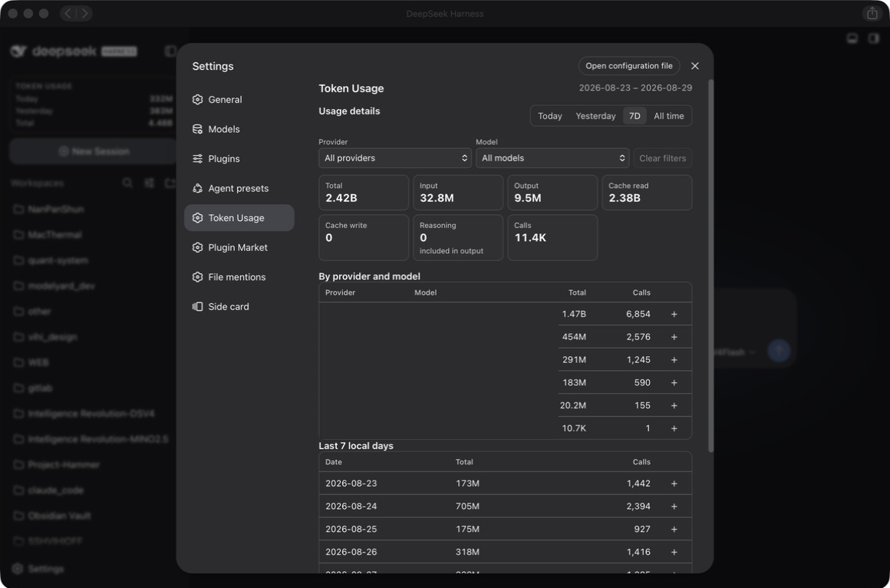

# dsh-token-usage-sidebar

English | [简体中文](README.zh-CN.md)

A community [DeepSeek Harness](https://github.com/deepseek-ai/deepseek-harness) (DSH) web-profile plugin that keeps provider-reported token usage locally. It provides both a persistent sidebar summary and a native **Token Usage** settings page.

**Project website:** [dsh-token-usage-sidebar](https://y2zyyr.github.io/dsh-token-usage-sidebar/)

[](https://www.npmjs.com/package/@y2zyyr/dsh-token-usage-sidebar)

```text
TOKEN USAGE
Today       …
Yesterday   …
Total       …
```

This is a community plugin, not an official DeepSeek plugin.

The working tree includes **unreleased reliability fixes** documented in
[CHANGELOG.md](CHANGELOG.md#unreleased). The published release remains v1.1.8.

## Features

- Sidebar summary: Today, Yesterday, and lifetime Total.
- Native **Settings → Token Usage** page, placed after Agent Presets and before Plugin Market.
- Compact per-range metric cards for Total, Input, Output, Cache, Reasoning,
  and Calls.
- Detail range selector: Today, Yesterday, 7D, and All time, with the filters
  kept on one compact row in the DSH modal.
- Per-range totals for Input, Output, Cache Read, Cache Write, Reasoning, and call count.
- Dynamic provider/model filters: the choices come from the exact provider and model names present in the selected range; no provider directory or preset supplier list is hard-coded.
- Provider/model filters use the exact names reported by DSH; the plugin does not ask users to configure a second provider-name mapping.
- Compact provider/model table with expandable bucket details, plus a seven-local-day table that retains zero-value days.
- Persistent local accounting that survives DSH restarts.
- **Scalable durable ledger (v1.1).** The lifetime accounting store is backed by a
  plugin-owned SQLite database (Node's built-in `node:sqlite`, WAL journal) instead
  of a monolithic JSON root. A new invocation is one small row-level upsert, so write
  latency stays effectively flat no matter how many historical records accumulate.
- **Automatic verified migration.** Legacy JSON records are imported and verified
  transactionally, retaining unrelated or newer SQLite records. The source is backed
  up before cutover; a failed migration restores the previous SQLite state.
- Each usage batch commits its records and aggregate updates before returning.
- Historical recovery from available authoritative session usage records, with
  honest scan/coverage reporting (a partial or failed scan never claims complete
  lifetime coverage).
- Replay-safe accounting: each provider attempt is counted once; explicit retries
  contribute their own reported usage, and forks exclude inherited events.
- Visible recovery, partial-history, and stale-data states; failures do not silently
  replace known totals with zero.
- Native placement in the DSH web sidebar.



## Installation

Recommended package: `@y2zyyr/dsh-token-usage-sidebar` (published on the npm registry).

### Recommended — DeepSeek Harness

Install the plugin into the DSH `web` profile, then restart DSH:

```bash
dsh plugin --profile web add @y2zyyr/dsh-token-usage-sidebar
# Restart `dsh web` after installation.
```

`dsh plugin` accepts the scoped package name directly; the plugin is added to the
profile's bundle list and its loader entry keeps the stable id `token-usage-sidebar`.
You can also ask an agent that can access your DSH installation to install the npm
package `@y2zyyr/dsh-token-usage-sidebar` into the web profile (source: https://github.com/y2zyyr/dsh-token-usage-sidebar). Review
third-party source before authorizing an agent to install it. Pin a commit when your
workflow requires a reproducible dependency revision.

### npm

The package can be installed from npm directly:

```bash
npm install @y2zyyr/dsh-token-usage-sidebar
```

### Source

GitHub is the source repository (code, issues, release history, source inspection):
https://github.com/y2zyyr/dsh-token-usage-sidebar

A direct GitHub install also keeps working
(`dsh plugin --profile web add github:y2zyyr/dsh-token-usage-sidebar`), but the npm
scoped package is the recommended distribution channel.

## Update

Update the installed plugin, then restart DSH:

```bash
dsh plugin --profile web update @y2zyyr/dsh-token-usage-sidebar
# Restart `dsh web` after updating.
```

The plugin is versioned on npm with semantic versions.

## Removal

Removing the plugin does not reset its separately persisted local accounting data.

```bash
dsh plugin --profile web remove @y2zyyr/dsh-token-usage-sidebar
# Restart `dsh web` after removal.
```

### Upgrading from a v1.1.0 GitHub install

Existing v1.1.0 installs keep their complete ledger. Switch the profile bundle
from the old package name to the scoped one — the plugin keeps the same loader
entry ID, exported plugin name, client module ID, and SQLite ledger path, so no
data migration is needed:

```bash
dsh plugin --profile web remove dsh-token-usage-sidebar
dsh plugin --profile web add @y2zyyr/dsh-token-usage-sidebar
# Restart `dsh web` after the switch.
```

## How it works

```text
DSH/provider usage records
        ↓
historical and live collection
        ↓
deduplication
        ↓
persistent local accounting
        ↓
sidebar summary
```

The plugin uses provider/runtime-reported usage records rather than tokenizer estimates. Total is `input + cache read + cache write + output`; **Reasoning** is displayed as an output subdivision and is never added to Total a second time. It reads `assistant/message` and `assistant/attempt`, including the last usage chunk in their stream when direct usage is absent, and supports older standalone usage chunks. Provider/model labels come from `message.source` when available; missing labels remain unknown.

Accounting version 2 keeps `sessionId:turn:step` for the first attempt and appends
`:retry:<retry-started-seq>` for an explicit retry. A later usage sample replaces
the earlier sample within that attempt. Failed attempts with reported usage still
count; inherited fork history remains owned by the parent. Existing version 1 rows
are corrected only after a complete source replay, with a SQLite backup and a local
before/after audit. See [the accounting migration](docs/migrations/accounting-v2.md).

All day-based ranges use the DSH host's local calendar days. Last 7 days includes today plus the previous six local days, including empty days. A daily total already includes its dated unclassified tokens; they are not added twice. The settings page receives aggregate results only; it never receives the individual invocation ledger.

### Provider and model filtering

Provider options are discovered from the aggregate data in the selected range and are matched exactly. A user whose ledger only contains `my-company-api` sees that name; an empty preset-provider option is never added. Different spellings remain separate, and there is no separate alias form to fill in. Any legacy alias table left by an older release is retained for storage compatibility but is not exposed in the settings UI.

### Migration and historical coverage

The plugin also performs a narrow automatic discovery pass in the DSH
`storages` directory. It recognizes plugin-owned token record units, including
partitioned day ledgers from earlier local builds, and imports their invocation
details by the canonical `sessionId:turn:step` identity. Aggregate-only
summaries are used for verification and are never imported as extra calls.
Discovery is read-only against its sources and idempotent across restarts. Successful
imports reuse a cache only while the candidate filenames, file identities, sizes, and
modification/change timestamps match. Changed files and failed scans are rechecked.
It does not scan the general filesystem or require a manually configured path.

The host reads persisted sessions through the official `sessionPersistence` service,
including sessions that have never been opened in the current process. DSH 0.1 prefers
`listSnapshots` (falling back to `list`) and reads through `readFrom`; DSH 0.2 uses
read-only `open`/`read` handles that are always closed. Matching official revision
tokens skip unchanged logs entirely. Changed logs verify the checkpoint boundary
before folding their suffix; fresh legacy imports and aggregate repairs force full
replay. Some JSONL backends still parse the whole physical log when a read is needed.
Live listeners are registered before asynchronous recovery.

Some legacy calls may have a reliable All time total but no recoverable date, bucket, provider, or model. Those tokens remain included in All time and are explicitly shown as **unclassified coverage**. They are never invented into a date or model row.

**History reporting.** The API keeps two distinct signals in `health`:

- **Source scan status** — whether enumerated sessions were read successfully (`complete`, `partial`, `failed`, or `unknown`). A failed read prevents a complete scan.
- **Historical coverage** — `partial` when records exist, otherwise `unknown`. Enumerating available logs cannot prove that older or deleted sessions are recoverable, so this is never promoted to complete.

During initialization or a failed migration, summary/details return HTTP 503 with
an error and `health`, rather than a successful zero. With a readable existing ledger,
a partial source scan can still return known totals with a warning. The browser
shows its last successful update on a failed refresh, rejects obsolete responses,
and does not relabel an earlier range's numbers as the newly selected range.

**Total's meaning:** Lifetime **Total** is the deduplicated union of every authoritative usage record the plugin recovered from durable sources plus usage recorded after tracking began — it reflects what the plugin can recover, not a claim about the DSH account's full lifetime usage when not all history is provably recoverable.

### v1.0.1 → v1.1 upgrade migration

On first startup after upgrading to v1.1, the plugin detects the v1.0.1 JSON ledger and:

1. **Validates** the legacy ledger read-only (never modifies it).
2. **Backs up** the v1 ledger to a timestamped, immutable `.pre-v1.1-<timestamp>.bak`
   file in the same data directory.
3. **Creates/opens** the v1.1 SQLite ledger and inserts the canonical records.
4. **Derives** all aggregate tables (global, daily, provider/model) from the records.
5. **Verifies** the source total/count, the imported record union, provenance, and
   every global, daily, model, and day/model aggregate field. Existing unrelated or
   newer records remain part of the destination total.
6. **Cutover** — only if verification passes. Any mismatch marks the migration
   **failed**, all transactional changes roll back, and the v1 source is left untouched.

The migration is **idempotent**: a completed migration is a no-op on later restarts,
and no records are duplicated. New usage recorded after cutover is exactly-once.

See `docs/migrations/v1.0.1-to-v1.1.0.md` for the full design.

## Data & Privacy

Usage accounting stays local to the DSH runtime. The source repository does not receive, contain, or upload a user's token ledger. Runtime persistence is separate from the source code and release artifacts.

The plugin stores accounting metadata needed for reliable totals, such as deduplication identity, date bucket, and token totals. It does not persist prompts, assistant text, tool output, API keys, credentials, or conversation content as part of its ledger.

### Where v1.1 stores data (v1.1)

- **Local only.** All persistent data lives under the DSH data home. Nothing is uploaded.
- **SQLite ledger.** v1.1 stores the accounting ledger in a plugin-owned SQLite database:
  `${DSH_HOME:-~/.dsh}/storages/dsh_token_usage_sidebar.sqlite`, plus its WAL/shm
  companions. The exact path respects the `DSH_HOME` environment variable when set.
  It is never the source repo or the package install directory, so it survives
  upgrades, re-installs, and restarts.
- **No conversation contents.** The DB holds only deduplication ids (including retry suffixes),
  token bucket totals, provider/model labels, local dates, and accounting metadata.
  It never stores prompts, assistant text, tool output, API keys, credentials, or
  conversation content.
- **Legacy alias compatibility.** Older provider-alias rows remain in the database; alias configuration does not rewrite accounting records.
- **Upgrade backup.** Before cutover the v1.0.1 JSON ledger is copied to a timestamped
  `.pre-v1.1-<timestamp>.bak` file in the same directory. The v1 source is never deleted.
- **Accounting correction backup.** Before correcting legacy retry/fork accounting,
  the plugin creates an immutable `.pre-accounting-v2-<id>.bak` SQLite snapshot and
  retains prior numeric record metadata in `accounting_changes`. Inherited rows are
  excluded from totals rather than deleted. Unverifiable legacy rows remain counted.
- **Uninstall.** Removing the plugin does not delete this data.
- **Downgrade to v1.0.1.** The v1.1 SQLite ledger is not read by v1.0.1. To return to
  v1.0.1, restore the pre-upgrade v1 JSON backup (or the untouched v1 source) after
  reinstalling v1.0.1.

## Compatibility and Status

Current release: **v1.1.8** (npm package `@y2zyyr/dsh-token-usage-sidebar`; source on GitHub).

Verified with DeepSeek Harness `0.1.0-rc.6` and its `web` profile, on a runtime whose
Node.js provides the built-in `node:sqlite` module (Node with `node:sqlite`).
The package metadata also permits installation on DSH `0.2.0-rc.2`: it no longer
requires `@deepseek-ai/dsh-storage-domain`, which this plugin does not use, and accepts
Cordis `4.0.x`. Runtime behavior has not been separately smoke-tested on DSH
`0.2.0-rc.2`; `node:sqlite` remains required.

The unreleased changes require the official `sessionPersistence` host service. Their
DSH 0.1/0.2 adapters, actual host routes, and React components have automated fixture
coverage; a real DSH boot and manual UI smoke test remain unverified for these changes.

### Reliability guarantees (v1.1)

- **Flat write latency.** A new invocation is one small row-level SQLite upsert in WAL
  mode, independent of lifetime history size. Summary reads come from maintained
  aggregate tables, not a scan of the full record set.
- **Exactly-once accounting.** Each attempt has a stable identity and keeps its
  highest-sequence usage sample. Explicit retries are separate attempts; duplicates
  do not add another call.
- **Source of truth = records.** `usage_records` is authoritative; aggregate tables are a
  derived, rebuildable cache. Startup verifies all aggregate fields and repairs drift
  from valid records; invalid authoritative records stop initialization.
- **Verified migration.** Legacy records are verified as a union with existing
  SQLite history before cutover; a mismatch rolls back and preserves both sources.
- **Crash-safe migration.** The v1 source is only ever read/copied; a partial or failed
  migration never leaves unverified records visible and resumes cleanly.
- **Shutdown.** Committed batches are already durable before shutdown. Disposal
  cancels recovery, unregisters listeners/routes, and closes owned handles.

### Reliability guarantees (v1.0.1)

- **No lost writes on shutdown.** Dirty usage is flushed before the store closes; the persistence write is serialized so concurrent saves never race or reorder, and a transient write failure keeps the data recoverable for a later flush or close.
- **No silent reset on corrupt storage.** If the persisted ledger fails validation, the plugin warns, does not overwrite the corrupt source, and never presents a silent new Total of zero.
- **Source-scan invariants.** The live/historical split is recomputed from the authoritative records so lifetimeTotal = live + historical always holds.
- **Honest history reporting.** See *Migration and historical coverage*; a partial or failed scan is never mislabeled complete.

## Development

```bash
npm install
npm test
npm run build
npm run typecheck
npm run check:package
```

`npm test` includes accounting, recovery, integrity, migration, actual host-route,
React DOM, and property/equivalence tests using synthetic data. Type checking covers
both TS and TSX. Build emits real declaration files and keeps both client bundles
byte-aligned. `check:package` audits a temporary npm archive, imports its host, and
checks consumer types under NodeNext and Bundler resolution without requiring React
types for the public loader contract. CI runs these gates on Node 22/24 and requires
committed generated artifacts to match source. Use Node ≥22.19 or a current 24+ release
for development (built-in TypeScript stripping and the zstd fixtures are required).

## License

[MIT](LICENSE)
