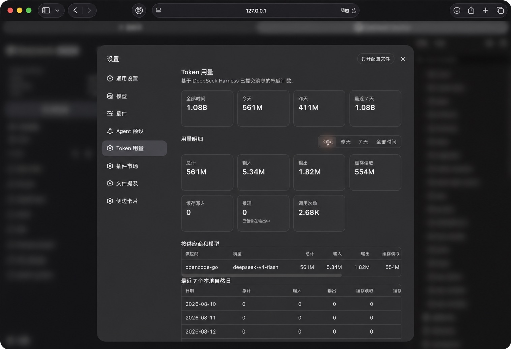

# dsh-token-usage-sidebar

[English](README.md) | 简体中文

这是一个面向 [DeepSeek Harness](https://github.com/deepseek-ai/deepseek-harness)（DSH）Web Profile 的社区插件，在侧边栏显示由 provider/runtime 上报并持久化保存的 Token 用量，并在原生设置中提供完整的 **Token 用量** 页面。

[](https://www.npmjs.com/package/@y2zyyr/dsh-token-usage-sidebar)

```text
TOKEN USAGE
Today       今日
Yesterday   昨日
Total       累计
```

这是社区插件，并非 DeepSeek 官方插件。

## 功能

- 侧边栏显示今日、昨日和累计 Token 用量。
- 在 **设置 → Token 用量** 中提供独立页面，位置在 Agent 预设之后、插件市场之前。
- 固定概览卡片：全部时间、今天、昨天、最近 7 天。
- 明细支持今天、昨天、7 天、全部时间四种范围。
- 显示输入、输出、缓存读取、缓存写入、推理、调用次数。
- 按供应商/模型汇总（按总量排序），并始终展示最近 7 个本地自然日（包含零值日期）。
- 本地持久化统计；重启 DSH 后不会归零。
- **可扩展的持久化账本（v1.1）。** 累计统计改由插件自有的 SQLite 数据库支撑（Node 内置 `node:sqlite`、WAL 日志），取代单一大 JSON 文件。每次新调用只是一次小的行级 upsert，无论历史记录有多少条，写入延迟都基本保持平稳。
- **自动校验迁移（v1.1）。** 升级时会自动把 v1.0.1 的现有统计迁移到新账本，并校验生命周期总计、记录数、按日与按供应商/模型统计完全一致后才切换。不会丢失或重复统计，切换前会备份 v1 账本。
- 关停安全持久化：在 store 关闭前先冲刷脏数据，快速重启 DSH 也不会丢失最新用量。
- 在存在权威会话用量记录时恢复历史用量，并如实报告扫描/覆盖状态（部分或失败的扫描绝不会声称完整的生命周期覆盖）。
- 对重放和重复事件去重，同一次调用只计入一次。
- 原生显示在 DSH Web 侧边栏。



## 安装

推荐包：`@y2zyyr/dsh-token-usage-sidebar`（已发布到 npm registry）。

### 推荐方式 — DeepSeek Harness

把 npm 包安装到 DSH 的 `web` profile，然后重启 DSH：

```bash
dsh plugin --profile web add @y2zyyr/dsh-token-usage-sidebar
# 安装后重启 `dsh web`。
```

`dsh plugin` 直接接受 scoped 包名；插件会加入 profile 的 bundle 列表，其 loader entry
仍保持稳定的 id `token-usage-sidebar`。也可以让能访问你本机 DSH 的 Agent 直接安装
`@y2zyyr/dsh-token-usage-sidebar` 到 web profile（源码见 https://github.com/y2zyyr/dsh-token-usage-sidebar）。授权第三方插件安装前请先审阅
源码；如需可复现的依赖版本，请固定到具体 commit。

### npm

也可以直接用 npm 安装：

```bash
npm install @y2zyyr/dsh-token-usage-sidebar
```

注意：在 DSH 中安装插件请使用上面的 `dsh plugin` 命令，裸 `npm install` 仅用于
需要直接以 npm 方式引用该包的项目。

### 源码（Source）

GitHub 仓库是源码、issue 与发布历史的来源（也用于源码审阅）：https://github.com/y2zyyr/dsh-token-usage-sidebar

直接从 GitHub 安装也仍然可用（`dsh plugin --profile web add github:y2zyyr/dsh-token-usage-sidebar`），
但推荐使用 npm scoped 包作为分发渠道。

## 更新

更新已安装的插件后重启 DSH：

```bash
dsh plugin --profile web update @y2zyyr/dsh-token-usage-sidebar
# 更新后重启 `dsh web`。
```

插件在 npm 上使用语义化版本管理。

## 卸载

卸载插件不会自动清空独立保存的本地用量统计。

```bash
dsh plugin --profile web remove @y2zyyr/dsh-token-usage-sidebar
# 卸载后重启 `dsh web`。
```

### 从 v1.1.0（GitHub 安装）升级

已有 v1.1.0 安装会完整保留账本。把 profile bundle 从旧包名切换到 scoped 包名即可——
插件保持相同的 loader entry ID、导出的插件名、client module ID 与 SQLite 账本路径，
因此无需数据迁移：

```bash
dsh plugin --profile web remove dsh-token-usage-sidebar
dsh plugin --profile web add @y2zyyr/dsh-token-usage-sidebar
# 切换后重启 `dsh web`。
```

## 工作方式

```text
DSH/provider 用量记录
        ↓
历史记录与实时记录采集
        ↓
去重
        ↓
本地持久化统计
        ↓
侧边栏摘要
```

插件使用 provider/runtime 上报的用量记录，而不是 tokenizer 估算值。总计为 `输入 + 缓存读取 + 缓存写入 + 输出`；**推理**只是输出的细分展示，绝不会再次加到总计。最终提交消息中的 `message.source.provider/model` 用于模型归属。

所有按日范围均使用 DSH 主机本地自然日；最近 7 天包含今天和此前 6 天。设置页只请求聚合结果，不会把逐调用账本发送到浏览器。

### 迁移与历史覆盖

v1.0.0/v1.0.1 会对可恢复的 DSH 持久会话事件做一次幂等重放，为已有调用补齐精确 buckets 和模型元数据。已有调用只会被补充信息，或被更高 seq 的最终消息替换，不会重复增加累计用量。

少量旧调用可能只有可靠的全部时间总计，无法再恢复日期、类别、供应商或模型。它们仍包含在全部时间中，并以“未分类覆盖”明确显示；插件不会伪造日期或模型归属。

**历史报告如实（v1.0.1）。** 插件区分两个不同信号：

- **来源扫描状态** —— 插件能枚举到的每个 session 是否都读取成功（complete / partial / failed / unknown）。只要有 session 读取失败，扫描状态就降为 partial，绝不能声称 complete。
- **历史覆盖** —— 是否能断言已恢复的记录代表了插件的完整生命周期历史（complete / partial / unknown）。因为枚举今天的 session 日志并不能证明不存在更早、已删除或超出窗口的 session，所以覆盖状态通常始终为 partial（无可恢复内容时为 unknown）。插件绝不会因为“找到了一些 session”就把扫描标记为完整。

**Total 的含义：** 生命周期 **Total** 是插件从持久化来源恢复的全部权威用量记录，加上开始追踪后记录的用量的去重并集——它反映的是插件可恢复的内容，而不是在无法证明完整历史时对 DSH 账户完整生命周期用量的断言。

### v1.0.1 → v1.1 升级迁移

升级到 v1.1 后首次启动时，插件会检测到 v1.0.1 的 JSON 账本，然后：

1. **只读校验** 旧账本（绝不修改它）。
2. **备份** v1 账本为同目录下的、带时间戳的不可变 `.pre-v1.1-<timestamp>.bak` 文件。
3. **创建/打开** v1.1 SQLite 账本并写入规范性记录。
4. **推导** 所有聚合表（全局 / 按日 / 按供应商与模型）。
5. **校验** 统计完全一致（生命周期总计、记录数，以及 `sum(records) == global`）。
6. **切换** ——仅在校验通过后进行。任何不一致都会把迁移标记为 **failed**，不切换，v1 源保持不变。

迁移是**幂等**的：已完成迁移在后续重启时不再执行，也不会产生重复记录。切换后新记录的用量严格只计一次。

详见 `docs/migrations/v1.0.1-to-v1.1.0.md`。

## 数据与隐私

用量统计保留在本机 DSH runtime 中。GitHub 源码仓库不会接收、包含或上传你的 Token 账本；运行时持久化数据与源码和发布产物相互独立。

为了得到可靠的累计数据，插件仅保存必要的统计元数据，例如去重标识、日期桶和 Token 总数。其账本不保存提示词、助手文本、工具输出、API Key、凭据或对话内容。

### v1.1 数据存放位置

- **仅保存在本地。** 所有持久化数据都在 DSH 数据主目录下，不会上传。
- **SQLite 账本。** v1.1 把统计账本存放在插件自有的 SQLite 数据库中：
  `${DSH_HOME:-~/.dsh}/storages/dsh_token_usage_sidebar.sqlite`（外加其 `-wal`/`-shm` 伴生文件）。具体路径在设置了 `DSH_HOME` 时遵从该环境变量。它不在源码仓库或插件安装目录里，因此升级、重装、重启都会保留。
- **不含对话内容。** 只保存去重标识（`sessionId:turn:step`）、各 token 桶总计、供应商/模型标签、本地日期与统计元数据。绝不会保存提示词、助手文本、工具输出、API Key、凭据或对话内容。
- **升级备份。** 切换前会把 v1.0.1 的 JSON 账本复制为带时间戳的 `.pre-v1.1-<timestamp>.bak` 文件；v1 源永不删除。
- **卸载。** 卸载插件不会删除这些数据。
- **降级到 v1.0.1。** v1.0.1 无法读取 v1.1 的 SQLite 账本。如需回到 v1.0.1，请先重装 v1.0.1，再恢复升级前的 v1 JSON 备份（或未被改动的 v1 源）。

## 兼容性与状态

当前插件版本：**v1.1.1**（npm 包 `@y2zyyr/dsh-token-usage-sidebar`；源码见 GitHub）。

已在支持的运行时（提供 Node 内置 `node:sqlite` 模块）上验证 DeepSeek Harness `0.1.0-rc.6` 的 `web` profile；未声明更广泛的 DSH 版本或操作系统兼容性。已在本地观察到其运行于更新版本的桌面端（如 DSH Desktop 2.0.0 / Node 26），但不做正式声明。

### 可靠性保证（v1.1）

- **写入延迟保持平稳。** 每次新调用都是一次小型的行级 SQLite upsert（WAL 模式），不受生命周期历史量影响。摘要读取来自维护好的聚合表，而不是扫描全部记录。
- **严格一次计数。** 规范性标识为 `sessionId:turn:step`；最终提交的 `assistant/message.usage` 会取代更早的 `assistant/chunk` 样例，重放/重复不会重复计数（取更高 seq）。
- **记录即真源。** `usage_records` 是权威来源；聚合表只是可重算的派生缓存。若聚合出现偏差，可从记录重建。
- **迁移已校验。** v1.0.1 的统计在切换前会被校验完全一致；不一致则失败关闭并保留 v1 源。
- **迁移崩溃安全。** v1 源只读/只备份；部分或失败的迁移绝不会暴露未校验的记录，并能在重启后干净地重试。
- **关停不丢写。** 关停前冲刷脏数据，并提交/检查点 SQLite 账本。

### 可靠性保证（v1.0.1）

- **关停不丢写。** 在 store 关闭前先冲刷脏数据；持久化写入被串行化，并发保存不会竞争或乱序，瞬时写入失败也会把数据保留以供后续 flush 或 close 重试。
- **存储损坏时不静默归零。** 若持久化账本校验失败，插件会告警、不会覆盖损坏的来源数据，也绝不会静默地把 Total 显示为 0。
- **来源拆分不变量。** 实时/历史拆分会从权威记录重新计算，保证 lifetimeTotal = live + historical 始终成立。
- **如实报告历史。** 参见“迁移与历史覆盖”；部分或失败的扫描绝不会被错误标记为 complete。

## 开发

```bash
npm install
npm test
npm run build
npx tsc --noEmit   # 类型检查（v1.1 新增此门槛）
```

`npm test` 运行用量统计、历史恢复、洞察、SQLite 持久化、迁移与属性等价性测试；`npm run build` 将发布用的 host 和 browser bundle 写入 `lib/`，并保持根目录 `client.js` 与 `lib/client.js` 字节一致。GitHub Actions CI（`.github/workflows/ci.yml`）会执行 `npm ci`、`npm test`、`npm run build` 以及 `git diff --exit-code`，确保已提交的产物始终与源码一致。

## 许可证

[MIT](LICENSE)
