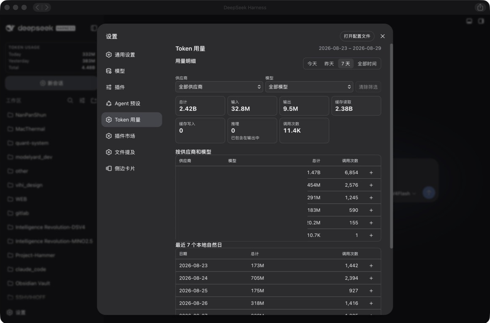

# dsh-token-usage-sidebar

[English](README.md) | 简体中文

这是一个面向 [DeepSeek Harness](https://github.com/deepseek-ai/deepseek-harness)（DSH）Web 和 Desktop profile 的社区插件，在侧边栏显示由 provider/runtime 上报并持久化保存的 Token 用量，并在原生设置中提供完整的 **Token 用量** 页面。

**项目网站：** [dsh-token-usage-sidebar](https://y2zyyr.github.io/dsh-token-usage-sidebar/zh/)

[](https://www.npmjs.com/package/@y2zyyr/dsh-token-usage-sidebar)

```text
TOKEN USAGE
Today       今日
Yesterday   昨日
Total       累计
```

这是社区插件，并非 DeepSeek 官方插件。

**v1.1.11** 在恢复历史期间显示已有用量：启动完整性检查通过后返回账本中已有的用量，持久化会话核验改在
**后台**进行（不再让接口停在 `initializing` 上）；来源指纹未变化的失败会话会被**记住**
（schema 4，纯新增表），不再每次启动都重读。来源文件标识或不透明 revision 变化、超过 24 小时重试窗口，或启动时
修复过聚合后，才会重新尝试。详见 [CHANGELOG.md](CHANGELOG.md)。

**v1.1.10** 移除了界面上的两处历史提示（「部分历史尚未核实」与「已核实的历史用量调整」）；
覆盖率与调整量数据仍保留在 summary/details API 返回值中。

## 功能

- 侧边栏显示今日、昨日和累计 Token 用量。
- 在 **设置 → Token 用量** 中提供独立页面，位置在 Agent 预设之后、插件市场之前。
- 紧凑显示每个范围的总计、输入、输出、缓存、推理和调用次数。
- 明细支持今天、昨天、7 天、全部时间四种范围，供应商、模型和清除筛选保持在同一行。
- 显示输入、输出、缓存读取、缓存写入、推理、调用次数。
- 动态供应商/模型筛选：选项来自当前范围中实际出现的精确 provider/model 名称，不内置任何供应商列表。
- 供应商/模型筛选直接使用 DSH 实际上报的精确名称；插件不再要求用户额外填写一套供应商名称映射。
- 按总量排序的紧凑供应商/模型表格，支持展开明细；并始终展示最近 7 个本地自然日（包含零值日期）。
- 本地持久化统计；重启 DSH 后不会归零。
- **可扩展的持久化账本（v1.1）。** 累计统计改由插件自有的 SQLite 数据库支撑（Node 内置 `node:sqlite`、WAL 日志），取代单一大 JSON 文件。每次新调用只是一次小的行级 upsert，无论历史记录有多少条，写入延迟都基本保持平稳。
- **自动校验迁移。** 在事务内导入并核验旧 JSON 明细，保留 SQLite 中独立或更新的记录。切换前备份来源；迁移失败时回滚到原有 SQLite 状态。
- 每批用量记录与聚合更新会在返回前一起提交。
- 在存在权威会话用量记录时恢复历史用量，并如实报告扫描/覆盖状态（部分或失败的扫描绝不会声称完整的生命周期覆盖）。
- 按 provider 实际调用尝试去重；明确的重试分别计入上报用量，fork 排除继承事件。
- 明确显示恢复中、历史未完全核验和数据更新失败的状态，失败时不会静默归零。
- 原生显示在 DSH Web 侧边栏。



## 安装

推荐包：`@y2zyyr/dsh-token-usage-sidebar`（已发布到 npm registry）。

### 推荐方式 — DeepSeek Harness

把 npm 包安装到 DSH 的 `web` profile，然后重启 DSH：

```bash
dsh plugin --profile web add @y2zyyr/dsh-token-usage-sidebar
# 安装后重启 `dsh web`。
```

桌面版请使用 DeepSeek Harness Desktop 提供的 `dsh` 命令：

```bash
dsh plugin --profile desktop add @y2zyyr/dsh-token-usage-sidebar
# 安装后重启 DeepSeek Harness Desktop。
```

Desktop 提供的 CLI 可以管理其保留的 `desktop` profile。更新和卸载时也使用这个
CLI，把下方命令中的 `web` 替换为 `desktop` 即可。

`dsh plugin` 直接接受 scoped 包名；插件会加入 profile 的 bundle 列表，其 loader entry
仍保持稳定的 id `token-usage-sidebar`。也可以让能访问你本机 DSH 的 Agent 直接安装
`@y2zyyr/dsh-token-usage-sidebar` 到 web profile（源码见 https://github.com/y2zyyr/dsh-token-usage-sidebar）。授权第三方插件安装前请先审阅
源码；如需可复现的依赖版本，请固定到具体 commit。

### npm

也可以直接用 npm 安装：

```bash
npm install @y2zyyr/dsh-token-usage-sidebar
```

注意：在 DSH 中安装插件请使用上面的 `dsh plugin` 命令，裸 `npm install` 仅用于
需要直接以 npm 方式引用该包的项目。

### 源码（Source）

GitHub 仓库是源码、issue 与发布历史的来源（也用于源码审阅）：https://github.com/y2zyyr/dsh-token-usage-sidebar

直接从 GitHub 安装也仍然可用（`dsh plugin --profile web add github:y2zyyr/dsh-token-usage-sidebar`），
但推荐使用 npm scoped 包作为分发渠道。

## 更新

更新已安装的插件后重启 DSH：

```bash
dsh plugin --profile web update @y2zyyr/dsh-token-usage-sidebar
# 更新后重启 `dsh web`。
```

插件在 npm 上使用语义化版本管理。

## 卸载

卸载插件不会自动清空独立保存的本地用量统计。

```bash
dsh plugin --profile web remove @y2zyyr/dsh-token-usage-sidebar
# 卸载后重启 `dsh web`。
```

### 从 v1.1.0（GitHub 安装）升级

已有 v1.1.0 安装会完整保留账本。把 profile bundle 从旧包名切换到 scoped 包名即可——
插件保持相同的 loader entry ID、导出的插件名、client module ID 与 SQLite 账本路径，
因此无需数据迁移：

```bash
dsh plugin --profile web remove dsh-token-usage-sidebar
dsh plugin --profile web add @y2zyyr/dsh-token-usage-sidebar
# 切换后重启 `dsh web`。
```

## 工作方式

```text
DSH/provider 用量记录
        ↓
历史记录与实时记录采集
        ↓
去重
        ↓
本地持久化统计
        ↓
侧边栏摘要
```

插件使用 provider/runtime 上报的用量记录，而不是 tokenizer 估算值。总计为 `输入 + 缓存读取 + 缓存写入 + 输出`；**推理**只是输出的细分展示，绝不会再次加到总计。采集支持 `assistant/message`、`assistant/attempt`，直接 usage 缺失时读取其 stream 中最后一个 usage chunk，并兼容旧版独立 usage chunk。供应商与模型取自可用的 `message.source`；缺失时保留为未知。

统计口径版本 2 保留首次尝试的 `sessionId:turn:step` 标识，明确重试则追加
`:retry:<retry-started-seq>`。同一尝试只保留最高 seq 的用量样本；失败尝试只要
上报了用量也会计入，fork 继承历史仍归父会话所有。已有版本 1 记录必须先完成
来源重放才能校正，并保留 SQLite 备份与调整前后的本地审计。详见
[统计口径迁移说明](docs/migrations/accounting-v2.md)。

所有按日范围均使用 DSH 主机本地自然日；最近 7 天包含今天和此前 6 天，包括零值日期。每日总计已经包含当天的未分类用量，不会再次相加。设置页只请求聚合结果，不会把逐调用账本发送到浏览器。

### 供应商与模型筛选

供应商选项由当前时间范围的聚合数据动态生成，并采用精确匹配。账本里只有 `my-company-api` 时，界面只显示这个名称，不会凭空增加预设供应商。`scnet`、`SCNET` 和 `scnet-api` 默认保持独立，也不再要求用户在插件里重复维护供应商名称映射。旧版本已经写入的别名表会保留以兼容存储，但当前设置页不再显示或编辑它。

### 迁移与历史覆盖

插件还会在 DSH 的 `storages` 目录执行受控的自动发现，识别插件自有的
Token 明细单元，包括早期本地版本写出的分日账本，并按规范的
`sessionId:turn:step` 调用标识导入明细。只有聚合摘要的文件只用于校验，
不会被当作另一批调用再次累加。发现过程对源文件只读，重启时幂等。只有文件
列表、文件身份、大小、修改和变更时间均未变化时，才复用成功导入的缓存；文件
变化或扫描失败都会重新检查。不会扫描整个文件系统，也不要求手工填写固定路径。

当前 host 通过官方 `sessionPersistence` 服务读取持久会话，包括本次进程中从未
打开的会话。DSH 0.1 优先使用 `listSnapshots`（不支持时回退到 `list`）及
`readFrom`；0.2 使用只读 `open`/`read`，结束后总会关闭句柄。官方 revision
标记未变时直接跳过日志；变化时先核验检查点边界再处理后缀。新导入的旧记录和
聚合修复会触发完整重放。部分 JSONL 后端在确需读取时仍会解析整份物理日志。
实时监听在异步恢复前注册。

少量旧调用可能只有可靠的全部时间总计，无法再恢复日期、类别、供应商或模型。它们仍包含在全部时间中，并以“未分类覆盖”明确显示；插件不会伪造日期或模型归属。

**历史报告。** API 的 `health` 区分两个不同信号：

- **来源扫描状态** —— 已枚举会话是否读取成功（complete / partial / failed / unknown）。任何读取失败都会阻止 complete 状态。
- **历史覆盖** —— 有记录时为 partial，无记录时为 unknown。枚举现有日志无法证明不存在更早或已删除的会话，因此不会提升为 complete。

初始化中或迁移失败时，摘要和明细返回 HTTP 503、错误与 `health`，不会返回成功的
零值。已有账本可读而部分来源失败时，仍显示已知总计并提示。前端刷新失败时显示
上次成功更新时间，忽略过期响应；切换范围后不会把旧范围的数据当作新范围显示。

**Total 的含义：** 生命周期 **Total** 是插件从持久化来源恢复的全部权威用量记录，加上开始追踪后记录的用量的去重并集——它反映的是插件可恢复的内容，而不是在无法证明完整历史时对 DSH 账户完整生命周期用量的断言。

### v1.0.1 → v1.1 升级迁移

升级到 v1.1 后首次启动时，插件会检测到 v1.0.1 的 JSON 账本，然后：

1. **只读校验** 旧账本（绝不修改它）。
2. **备份** v1 账本为同目录下的、带时间戳的不可变 `.pre-v1.1-<timestamp>.bak` 文件。
3. **创建/打开** v1.1 SQLite 账本并写入规范性记录。
4. **推导** 所有聚合表（全局 / 按日 / 按供应商与模型）。
5. **校验** 来源总计与记录数、导入记录的并集、来源拆分，以及全局、按日、按模型和日期/模型的全部聚合字段。目的账本保留原有独立或更新的记录。
6. **切换** ——仅在校验通过后进行。任何不一致都会把迁移标记为 **failed**，回滚全部事务改动，v1 源保持不变。

迁移是**幂等**的：已完成迁移在后续重启时不再执行，也不会产生重复记录。切换后新记录的用量严格只计一次。

详见 `docs/migrations/v1.0.1-to-v1.1.0.md`。

## 数据与隐私

用量统计保留在本机 DSH runtime 中。GitHub 源码仓库不会接收、包含或上传你的 Token 账本；运行时持久化数据与源码和发布产物相互独立。

为了得到可靠的累计数据，插件仅保存必要的统计元数据，例如去重标识、日期桶和 Token 总数。其账本不保存提示词、助手文本、工具输出、API Key、凭据或对话内容。

### v1.1 数据存放位置

- **仅保存在本地。** 所有持久化数据都在 DSH 数据主目录下，不会上传。
- **SQLite 账本。** v1.1 把统计账本存放在插件自有的 SQLite 数据库中：
  `${DSH_HOME:-~/.dsh}/storages/dsh_token_usage_sidebar.sqlite`（外加其 `-wal`/`-shm` 伴生文件）。具体路径在设置了 `DSH_HOME` 时遵从该环境变量。它不在源码仓库或插件安装目录里，因此升级、重装、重启都会保留。
- **不含对话内容。** 只保存去重标识（含重试后缀）、各 token 桶总计、供应商/模型标签、本地日期与统计元数据。绝不会保存提示词、助手文本、工具输出、API Key、凭据或对话内容。
- **旧版别名兼容。** 旧版供应商别名行保留在数据库中；别名配置不会改写统计记录。
- **升级备份。** 切换前会把 v1.0.1 的 JSON 账本复制为带时间戳的 `.pre-v1.1-<timestamp>.bak` 文件；v1 源永不删除。
- **口径校正备份。** 校正旧版重试/fork 统计前，创建不可变的 `.pre-accounting-v2-<id>.bak` SQLite 快照，并在 `accounting_changes` 保留此前的数值记录。继承记录只从总计中排除，不删除；无法核实的旧记录仍保留在总计中。
- **卸载。** 卸载插件不会删除这些数据。
- **降级到 v1.0.1。** v1.0.1 无法读取 v1.1 的 SQLite 账本。如需回到 v1.0.1，请先重装 v1.0.1，再恢复升级前的 v1 JSON 备份（或未被改动的 v1 源）。

## 兼容性与状态

当前插件版本：**v1.1.11**（npm 包 `@y2zyyr/dsh-token-usage-sidebar`；源码见 GitHub）。

修复后的 host 与 client 已在 DeepSeek Harness Desktop `0.2.0-rc.2` 完成冒烟验证：
侧边栏与设置页显示、汇总和明细 API、原有账本记录保留及聚合一致性。运行时需提供
Node 内置 `node:sqlite` 模块和官方 `sessionPersistence` 服务。Cordis peer 范围覆盖
`4.0.x`；插件不依赖 `@deepseek-ai/dsh-storage-domain`。

早期版本曾验证 DSH `0.1.0-rc.6` 的 `web` profile。DSH 0.1/0.2 的读取适配、host 路由
与 React 组件已有自动化夹具测试；本次尚未重新完成 DSH 0.1 的人工冒烟测试。无法读取
或短于旧账本的历史日志不会覆盖原有用量；未核实的历史行仍保留在账本中，并通过 API
（`health.status`、`health.historicalCoverage`）对外报告，界面不再单独提示。历史较多
时，首次核验可能需要一定时间。

### 可靠性保证（v1.1）

- **写入延迟保持平稳。** 每次新调用都是一次小型的行级 SQLite upsert（WAL 模式），不受生命周期历史量影响。摘要读取来自维护好的聚合表，而不是扫描全部记录。
- **严格一次计数。** 每次尝试有稳定标识，只保留其最高 seq 用量。明确重试属于独立尝试，重复事件不会额外增加调用。
- **记录即真源。** `usage_records` 是权威来源；启动时核验全部聚合字段，用有效记录修复缓存偏差。权威记录无效时停止初始化。
- **迁移已校验。** 切换前核验旧记录与已有 SQLite 历史的并集；不一致则回滚并保留双方来源。
- **迁移崩溃安全。** v1 源只读/只备份；部分或失败的迁移绝不会暴露未校验的记录，并能在重启后干净地重试。
- **关停清理。** 用量批次已在返回前提交；卸载时取消恢复、注销监听与路由，并关闭读取句柄。
- **恢复历史期间显示已有用量（v1.1.11）。** 账本通过启动完整性检查后对外提供数据，持久化会话核验改在后台进行，不再把接口挡在 `initializing` 之后。来源指纹未变的失败会话会被记住（存储 schema 4），重启不会反复重读同一批无法核验的日志；来源变化、超过 24 小时重试窗口，或启动修复过聚合后才会重试。空账本仍然阻塞等待核验，因此失败的历史绝不会被当成 0 用量展示。

DSH 的 JSONL 历史 revision 包含其他会话来源的哈希。对失败读取，来源文件本身未变时，
其他历史的变化不会让缓存立即失效；相关来源的修复会在 24 小时重试窗口到期后的下次启动
重新核验。成功核验的 checkpoint 仍检查完整 revision。

存储 schema 4 仅增加可重建的扫描缓存，保留原有核算记录。1.1.10 及更早版本无法打开
schema 4；若可能回退旧版，请在升级前保留一份一致的账本备份。

### 可靠性保证（v1.0.1）

- **关停不丢写。** 在 store 关闭前先冲刷脏数据；持久化写入被串行化，并发保存不会竞争或乱序，瞬时写入失败也会把数据保留以供后续 flush 或 close 重试。
- **存储损坏时不静默归零。** 若持久化账本校验失败，插件会告警、不会覆盖损坏的来源数据，也绝不会静默地把 Total 显示为 0。
- **来源拆分不变量。** 实时/历史拆分会从权威记录重新计算，保证 lifetimeTotal = live + historical 始终成立。
- **如实报告历史。** 参见“迁移与历史覆盖”；部分或失败的扫描绝不会被错误标记为 complete。

## 开发

```bash
npm install
npm test
npm run build
npm run typecheck
npm run check:package
```

`npm test` 使用合成数据覆盖用量、恢复、完整性、迁移、实际 host 路由、React DOM
和属性等价性测试。类型检查覆盖 TS 与 TSX；构建输出真实声明文件并保持两份
client bundle 字节一致。`check:package` 审核临时 npm 包、导入 host，并分别在
NodeNext/Bundler 解析下检查消费者类型，公开 loader 类型无需内部 React 类型。
CI 在 Node 22/24 上执行这些检查，并验证已提交产物与源码一致。开发建议使用
Node ≥22.19 或较新的 24+ 版本，需要内置 TypeScript 擦除及 zstd 测试夹具支持。

## 许可证

[MIT](LICENSE)
